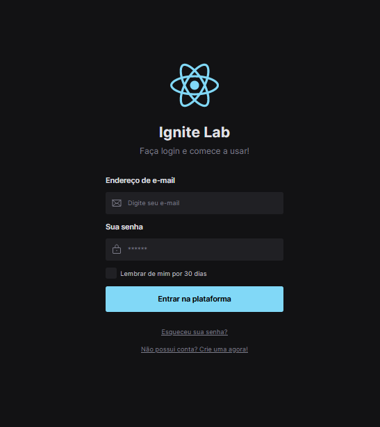

# lab-designer-system


### 📸 Print do Form criado:



<br>

### :rocket: Tecnologias usadas
Esse projeto foi desenvolvido com as seguintes tecnologias:
- [React](https://pt-br.reactjs.org/)
- [TypeScrip](https://www.typescriptlang.org/)
- [ViteJS](https://vitejs.dev)
- [Tailwind](https://www.tailwindapp.com)
  
### 💻 Projeto

<b>Ignite Lab Designer System</b> é um projeto oferecido pela <b>Rocketseat</b> para desenvolver com mais facilidade e rapidez novas interfaces e produtos de uma empresa. 

### ⚙ Como rodar este projeto

Antes de começar, você vai precisar ter instalado em sua máquina o <b>[Git](https://git-scm.com)</b> e também será preciso um editor, eu indico o <b>[VSCode](https://code.visualstudio.com/)</b>

### 🧭 Rodando o Frontend

```bash
# Clone este repositório
$ git clone https://github.com/pGaldino25/lab-designer-system

# Acesse a pasta do projeto no seu terminal/cmd
$ cd lab-designer-system

# Instale as dependências
$ npm install ou yarn add

# Execute a aplicação
$ npm run dev ou yarn start

# A aplicação será aberta na porta:3000 - acesse http://localhost:3000

```
